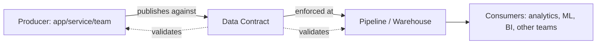
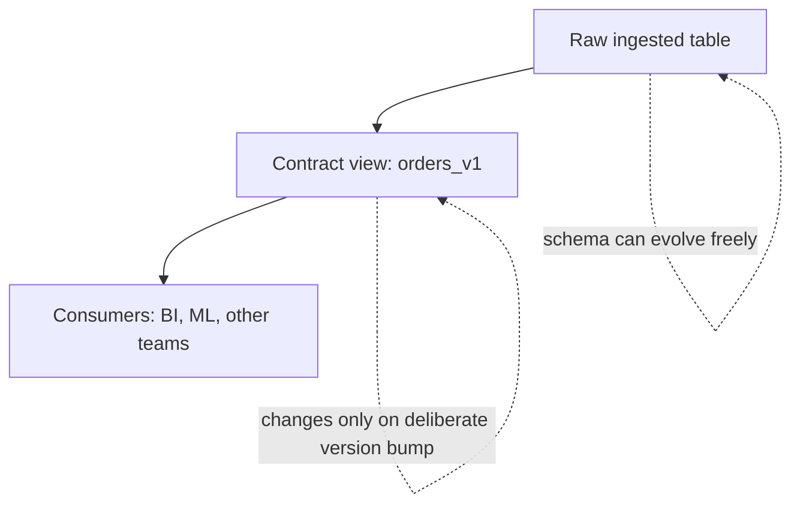

# Data Contracts: The Basics

## What is a data contract?

A **data contract** is a formal, machine-readable agreement between the team that *produces* data and the teams that *consume* it. It specifies:

- **Schema** - the exact fields, names, and data types a dataset will have.
- **Semantics** - what each field actually means (e.g., is `amount` in cents or dollars? Is `created_at` UTC?).
- **Quality guarantees** - expectations like "no nulls in `user_id`" or "99% of rows arrive within 15 minutes."
- **Change management** - how and when the schema is allowed to evolve, and how consumers get notified before it does.

The simplest way to think about it: an API contract (like an OpenAPI spec) tells consumers what to expect from an endpoint. A data contract does the same thing, but for a table, topic, or dataset instead of an endpoint.

Without a contract, "the schema" is really just whatever the upstream system happens to produce today - and it can change under you without warning. A contract turns that implicit, fragile assumption into an explicit, enforced promise.

---

## Where is it used?

Data contracts show up anywhere data crosses a team boundary:

- **Microservices → analytics** - an application team emits events (e.g., `order_placed`) that a data team ingests. The contract prevents an app-side refactor from silently breaking downstream dashboards.
- **Source systems → data warehouse** - CDC (change data capture) or batch loads from operational databases into Snowflake/BigQuery/Databricks. The contract locks down what "clean" raw data looks like before it lands.
- **Data producers → ML pipelines** - feature pipelines are especially sensitive to silent schema or distribution drift; a contract catches it before a model quietly degrades.
- **Cross-team data mesh** - in a data mesh setup, each domain team owns and publishes its own data products. Contracts are the mechanism that lets other domains consume that data with confidence, without having to ask "did anything change?" in a Slack thread.
- **Third-party data feeds** - vendor or partner data feeding into your warehouse, where you have zero control over the source but still need to detect breaking changes fast.

---

## Why modern data engineering needs to adopt this

For a long time, data teams treated schema breakage as a *reactive* problem: a dashboard breaks, someone investigates, they find out an upstream engineer renamed a column three days ago. That workflow doesn't scale, and it quietly erodes trust in data - the moment a report or a metric is wrong once, people stop trusting the whole system.

A few forces are pushing contracts from "nice to have" to standard practice:

- **Data is now a product, not a byproduct.** Teams increasingly treat internal datasets the way they treat public APIs - versioned, documented, and owned by someone accountable for their reliability.
- **Decoupling producers and consumers.** Application engineers shouldn't need to know every downstream dashboard that depends on a table before they ship a schema change. A contract lets them evolve independently, as long as they respect the agreed interface.
- **Shift-left data quality.** Instead of catching bad data in a BI tool weeks later, contracts push validation upstream - ideally into CI/CD, at the point the schema change is proposed, not after it has already broken something in production.
- **AI/ML raises the stakes.** Feature pipelines and LLM/RAG systems are far more sensitive to silent data drift than a human eyeballing a dashboard. Contracts (plus expectations/tests) are becoming a prerequisite for trustworthy ML, not an afterthought.
- **Governance and compliance.** Explicit contracts make it much easier to answer "what does this field mean, who owns it, and is it PII?" - questions regulators and internal governance teams increasingly ask.

In short: contracts move data quality from a downstream, reactive fire drill to an upstream, proactive guarantee - enforced automatically instead of relying on tribal knowledge and goodwill.

---

## Adopting data contracts in Snowflake

Snowflake doesn't (yet) ship a single, dedicated "data contract" object the way it has `TABLE` or `STREAM`, but it gives you the building blocks to enforce one, layered together:

| Layer | Snowflake feature | What it enforces |
|---|---|---|
| **Structural** | Native table constraints, `NOT NULL`, and **Data Metric Functions (DMFs)** | Column presence, types, null/uniqueness rules |
| **Semantic** | Column-level **tags** + **comments**, tied to a business glossary | What a field means, its owner, sensitivity classification |
| **Access & sensitivity** | **Dynamic Data Masking**, **Row Access Policies**, tag-based masking policies | Who can see what, enforced automatically as part of the contract |
| **Freshness/quality monitoring** | DMFs on a schedule, alerts, **Snowflake Alerts & Tasks** | SLA-style guarantees ("data lands within X minutes", "no more than Y% nulls") |
| **Change control** | Views/streams as a stable interface layer over raw tables, plus schema change history | Producers can change raw tables; the contract-facing view stays stable until a deliberate version bump |
| **Sharing boundary** | **Secure Views** and **Snowflake Data Sharing / Marketplace listings** | The contract *is* effectively the shared object's schema - consumers never see the underlying raw table |

A common pattern: don't expose raw ingested tables directly. Put a **contract view** in front of them that only ever exposes the agreed-upon columns and types. The raw table underneath can evolve freely; the view is the actual contract surface, and it only changes on a deliberate, versioned basis (e.g., `orders_v1`, `orders_v2`).

### Tech options beyond Snowflake-native features

If you want more structure than native Snowflake features alone provide, a few tools are commonly paired with a Snowflake warehouse:

- **dbt contracts** - dbt Core/Cloud has a built-in `contract` config on models, which enforces declared column names and types at build time and fails the build if the compiled model doesn't match. This is the most natural entry point if you're already using dbt (see my [Intro to dbt](/posts/intro-to-dbt/) post).
- **Great Expectations / Soda** - open-source data quality frameworks for defining and running expectations (nulls, ranges, freshness, distribution checks) against Snowflake tables, often as a CI or orchestration step.
- **Schema registries (Avro/Protobuf + Confluent Schema Registry)** - for contracts enforced further upstream, at the event/Kafka layer, before data ever reaches Snowflake.
- **Dedicated data contract tooling** (e.g., emerging players like Gable, or contract specs like the open-source **Data Contract Specification**) - YAML/JSON-based contract definitions that can generate documentation, run validation in CI, and act as a single source of truth shared across producer and consumer tooling.
- **Data catalogs** (e.g., Atlan, Select Star, Collibra, or Snowflake's own Horizon Catalog) - not a contract enforcement mechanism by themselves, but they make the contract *discoverable*, tying ownership, definitions, and lineage back to the enforced schema.

None of these are mutually exclusive - a mature setup often looks like: schema registry at ingestion → dbt contracts at transformation → DMFs/alerts for ongoing quality monitoring → a catalog tying it all together for humans to browse.

---

## Learning it hands-on

Reading about data contracts only gets you so far - the failure modes (a silent rename, a type change, a dropped column) are much easier to internalize when you've actually broken something and had to fix it.

That's why I built **The Contract Game** - a small, hands-on repo for practicing exactly this: producers and consumers, a schema that can drift, and the experience of catching (or missing) a breaking change before it causes damage downstream. [Play it here](https://ramanathanapa.github.io/the-contract-game/), or grab the [source on GitHub](https://github.com/ramanathanapa/the-contract-game). If this post made the concept click, that repo is the next step to make it stick.

---

## Further reading

- [The Rise of Data Contracts](https://dataproducts.substack.com/p/the-rise-of-data-contracts) by Chad Sanderson - the post that put data contracts on the map.
- [An Engineer's Guide to Data Contracts](https://dataproducts.substack.com/p/an-engineers-guide-to-data-contracts) - a practical, technical walkthrough from the same newsletter.
- [dbt Developer Hub: Model Contracts](https://docs.getdbt.com/docs/mesh/govern/model-contracts) - the reference docs for the enforcement mechanism mentioned above.

---

## Conclusion

A data contract is a simple idea with an outsized payoff: make the implicit agreement between data producers and consumers explicit, versioned, and enforced - instead of hoping nobody breaks anything. Modern data engineering is trending firmly in this direction, treating datasets as products with real interfaces rather than as loose collections of tables anyone can change at will.

You don't need to adopt every tool in the table above on day one. Start small: put a stable view in front of your most important raw tables, add a few DMFs or dbt contract checks on your most-consumed models, and grow the practice from there. Then go try breaking (and fixing) one yourself - [play The Contract Game](https://ramanathanapa.github.io/the-contract-game/) or check out the [source on GitHub](https://github.com/ramanathanapa/the-contract-game).
