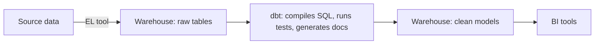
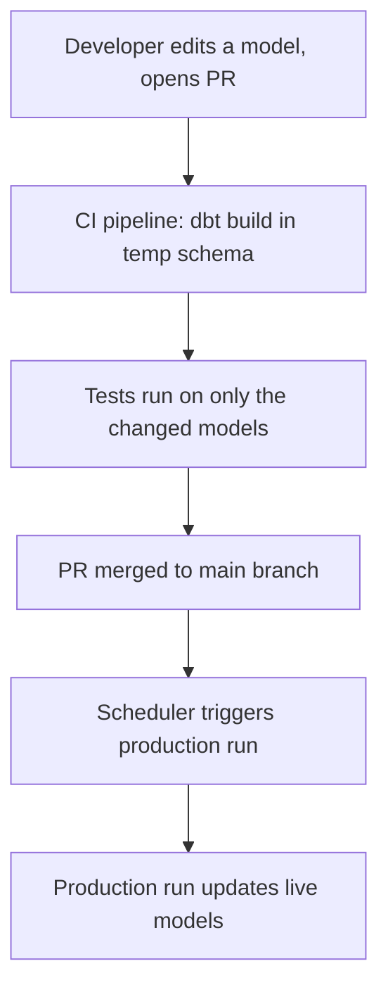
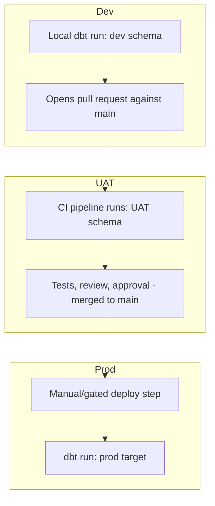

# Introduction to dbt (Data Build Tool)

## What is dbt?

dbt (data build tool) is a transformation framework that lets data teams write plain SQL `SELECT` statements to define data models, which dbt then compiles and runs directly inside a cloud data warehouse.

It represents the "T" in ELT (Extract, Load, Transform) — dbt does not extract data from source systems or load it into a warehouse. It only handles the transformation step, turning raw loaded data into clean, tested, documented tables and views.

The core idea: if you can write a SQL `SELECT` statement, you can build a dbt model. This brings software engineering practices — version control, automated testing, modularity, and documentation — to a process that was traditionally a tangle of untracked, undocumented SQL scripts.

---

## History

- **2016** — dbt originated at RJMetrics as a way to add basic transformation capabilities to Stitch (a data integration tool later acquired by Talend in 2018).
- From the start, dbt was released as open source.
- **2018** — The team behind dbt, then called Fishtown Analytics, launched a commercial product built on top of the open-source dbt Core.
- **2020–2021** — The company raised a rapid sequence of funding rounds (Series A through C) from investors including Andreessen Horowitz, Sequoia Capital, and Altimeter Capital.
- **2021** — Fishtown Analytics rebranded to **dbt Labs**.
- **2022** — A Series D round valued the company at $4.2 billion.
- **2026** — dbt Labs announced dbt Core v2.0 (alpha) at Snowflake Summit, built on a new high-performance engine called **Fusion**, alongside a broader push into semantic layers, AI copilots, and multi-project architectures.

---

## High-Level Use Cases

- **Warehouse-native transformation** — Converting raw, ingested data into clean, business-ready tables and views directly inside a cloud warehouse (Snowflake, BigQuery, Databricks, Redshift, etc.).
- **Data testing and quality checks** — Built-in tests (uniqueness, not-null, referential integrity, custom rules) run automatically as part of the pipeline, catching issues before bad data reaches dashboards.
- **Documentation and lineage** — Automatically generates documentation and a visual dependency graph (DAG) showing how models relate to and depend on one another.
- **Version-controlled analytics engineering** — SQL transformation logic lives in Git, gets peer-reviewed through pull requests, and is tested via CI/CD — just like application code.
- **Semantic layer / consistent metrics** — Business metrics (e.g., revenue, active users, churn) are defined once and reused everywhere, so different BI tools and analysts don't each calculate them differently.
- **Multi-team, multi-project architecture** — Larger organizations can split dbt projects across domains or teams while still sharing and referencing models across projects.

---

## Architecture: How dbt Fits In

dbt does not move data. It connects to a warehouse where data has already been loaded, reads raw tables, compiles SQL models, runs them back into the same warehouse, and generates documentation and test results along the way.

## CI/CD Integration

dbt projects are stored in Git, so every code change can be automatically tested before it reaches production — the same way application code is tested.

A common pattern here is **Slim CI**: instead of rebuilding the entire project on every pull request, dbt compares the proposed changes against the current production state and runs/tests only the models that were actually affected — keeping CI fast even on large projects.

### Environment-wise flow (Dev → UAT → Prod)

In practice, teams typically map dbt "targets" (defined in `profiles.yml` or the dbt Cloud UI) to different environments, each pointing at a different schema or even a different warehouse account:

- **Dev** — a developer runs dbt locally (or in a personal dbt Cloud IDE session) against a `dev` schema, iterating freely without affecting anyone else.
- **UAT** — opening a pull request triggers a CI job that builds and tests the changed models in a shared UAT schema. Once reviewed and approved, the PR is merged into `main`.
- **Prod** — merging to `main` does **not** automatically deploy. Production only updates through a separate, deliberate deploy step (manual trigger or a gated/approved pipeline run), which then executes dbt against the `prod` target.

This gives an explicit checkpoint between "code is approved" and "production is actually updated" — useful when you want a person or a change-control process to consciously decide when a release goes live, rather than having every merge immediately affect production data.

---

## Quick Glossary

| Term | Meaning |
|---|---|
| **Model** | A single `.sql` file containing a `SELECT` statement; dbt compiles it into a table or view in the warehouse. This is the basic building block of a dbt project. |
| **Source** | A reference to a raw table already sitting in the warehouse (typically loaded by a separate ingestion tool), which dbt models can build on top of. |
| **Seed** | A small, static CSV file checked into the project and loaded into the warehouse by dbt — often used for lookup or mapping tables. |
| **Snapshot** | A mechanism for capturing how a table's data changes over time (slowly changing dimensions), preserving historical states. |
| **Macro** | A reusable block of code (written in Jinja, a templating language) that can be called across multiple models — similar to a function. |
| **Test** | An assertion applied to a model or column (e.g., not-null, unique, accepted values) that runs automatically and fails the build if violated. |
| **DAG (Directed Acyclic Graph)** | The visual map of how all models depend on one another, automatically generated from the `ref()` relationships between models. |
| **ref()** | A function used inside a model to reference another model, letting dbt automatically determine build order and dependencies. |
| **Materialization** | The strategy dbt uses to build a model in the warehouse — common types are `view`, `table`, `incremental`, and `ephemeral`. |
| **dbt Core** | The free, open-source command-line tool that compiles and runs dbt projects. |
| **dbt Cloud / dbt Platform** | The managed, commercial layer built on top of dbt Core, adding scheduling, a web IDE, semantic layer, and collaboration features. |
| **Semantic Layer** | A centralized definition layer for business metrics, ensuring consistent calculations across BI tools. |
| **Mesh** | An architecture pattern for splitting a large dbt implementation across multiple projects/teams while allowing cross-project references. |
| **Manifest** | A JSON file dbt generates describing the full state of a project — models, tests, dependencies — used for tooling and state comparisons. |
| **Target / Profile** | The connection details (warehouse, credentials, schema) dbt uses for a given run, defined in `profiles.yml`. Switching the `target` (e.g. `dev`, `uat`, `prod`) points the same project at a different environment. |
| **Adapter** | The plugin that lets dbt speak to a specific warehouse (e.g. `dbt-snowflake`, `dbt-bigquery`, `dbt-redshift`). Core SQL logic stays the same; the adapter translates it to that warehouse's dialect. |
| **Package** | A reusable, shareable dbt project (macros, models) that can be imported into your own project, similar to a library — commonly sourced from dbt Hub or a Git repo. |
| **Exposure** | A defined downstream use of dbt models — a dashboard, report, or application — documented in the project so lineage extends beyond the warehouse into where the data is actually consumed. |
| **Contract** | An explicit declaration of a model's expected columns and data types, enforced at build time so the model fails fast if its output doesn't match what was promised. |
| **State (`state:modified`)** | A comparison mode where dbt checks the current project against a previous "known good" state (e.g. production) to figure out exactly which models changed — the basis for Slim CI. |
| **Defer** | A flag that lets a dev/CI run reference already-built production tables for unchanged models, instead of rebuilding the entire dependency chain — key to keeping CI fast. |
| **Jinja** | The templating language embedded in dbt SQL files, enabling macros, loops, conditionals, and variables inside otherwise-plain SQL. |
| **Artifact** | Any of the JSON files dbt produces after a run (`manifest.json`, `run_results.json`, `catalog.json`) — used by CI tooling, docs, and state comparisons. |
| **Node** | dbt's internal term for any object in a project — a model, test, seed, snapshot, or source — each becoming a point in the DAG. |
| **Freshness** | A check on how up-to-date a source table is, based on a timestamp column, used to alert if upstream data has stopped loading. |